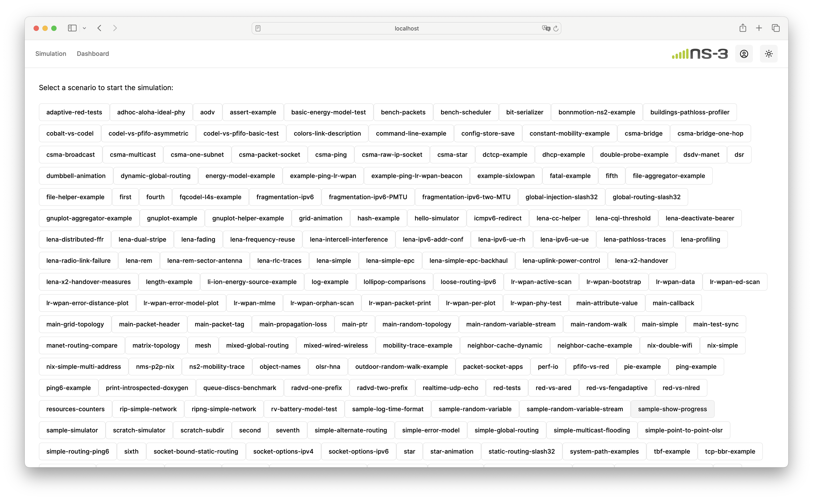
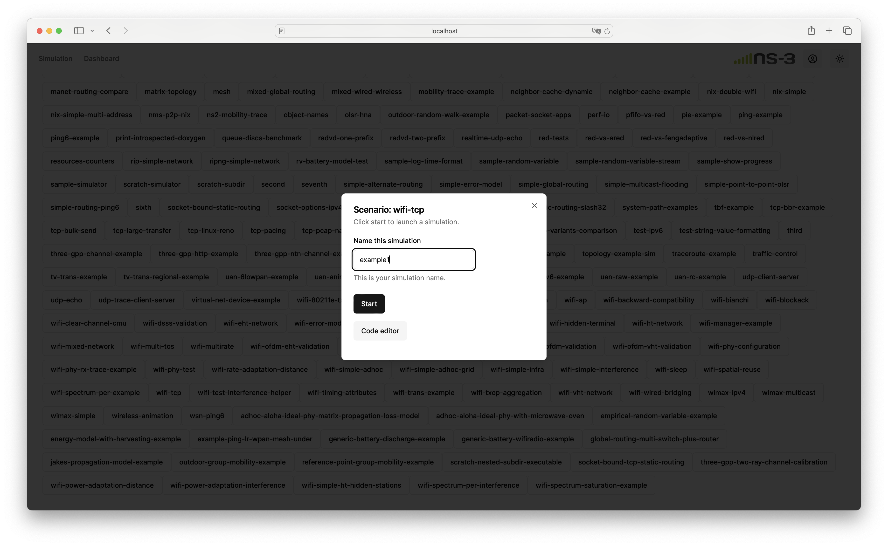
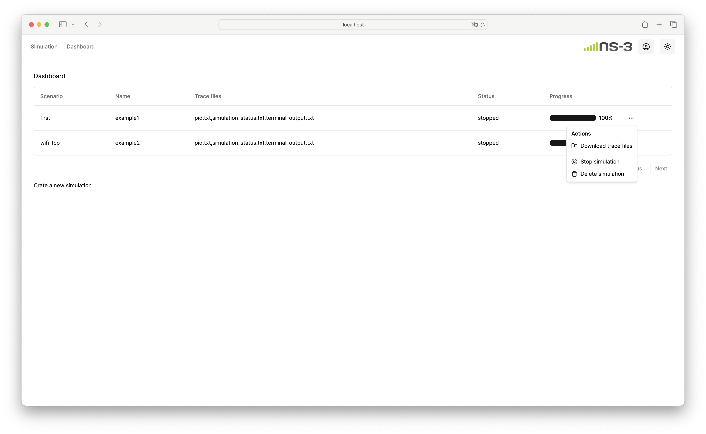

# ns-3 WebUI

The ns-3 WebUI is a web application designed to display ns-3 example scripts (with future plans to support Local LLMs for code editing), initiate ns-3 simulations, monitor simulation progress, and download simulation traces.



The ns-3 WebUI is designed using [Next.js](https://nextjs.org/) and the [shadcn/ui](https://ui.shadcn.com/) framework.

User authentication, e.g., login/logout pages, are based on [Lucia](https://lucia-auth.com/) and the sqlite3 database. Download the [DB Browser for SQLite](https://sqlitebrowser.org/) to manage the `main.db` database file.

## System Requirements

[node.js v20.15.1](https://nodejs.org/en) or later.

## Install ns-3

In the root directory, clone ns-3.42 from GitLab:

```
git clone -b ns-3.42 https://gitlab.com/nsnam/ns-3-dev.git
```

After downloading ns-3, install the dependencies and libraries from [ns-3 prerequisites](https://www.nsnam.org/docs/tutorial/html/getting-started.html#prerequisites). Build ns-3 with the following commands. You can find more information on building ns-3 [here](https://www.nsnam.org/docs/tutorial/html/getting-started.html#building-ns-3).

```
cd ns-3-dev
./ns3 configure --build-profile=optimized --enable-examples --disable-tests
./ns3 build
cd ..
```

You can set the build profile to debug (`--build-profile=debug`) if you would like ns-3 to print debug information.

Copy the modified `default-simulator-impl` to ns-3-dev. The modified simulator implementation logs the simulation timestamp into a trace file to trace simulation progress. Let me know if you have a better solution than modifying the source code.

```
cp ns-3-modified/default-simulator-impl.* ns-3-dev/src/core/model/
```

## Launch the ns-3 WebUI

In the root directory, run the following command to start the WebUI:

```
cd webui
echo 'NS3_PATH="../ns-3-dev"' > .env.local
npm install
npm run dev
```

The path to ns-3 is stored in `.env.local`. You can now access the webpage by visiting [http://localhost:3000](http://localhost:3000). Upon your first visit, you'll be directed to a login page where you can create a new account.

## Start a Simulation

Once logged in, access the simulation page and select a scenario to start simulation.



Upon starting the simulation, navigate to the dashboard page to monitor simulation progress and download trace files.


